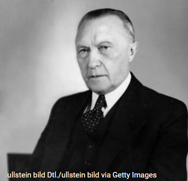
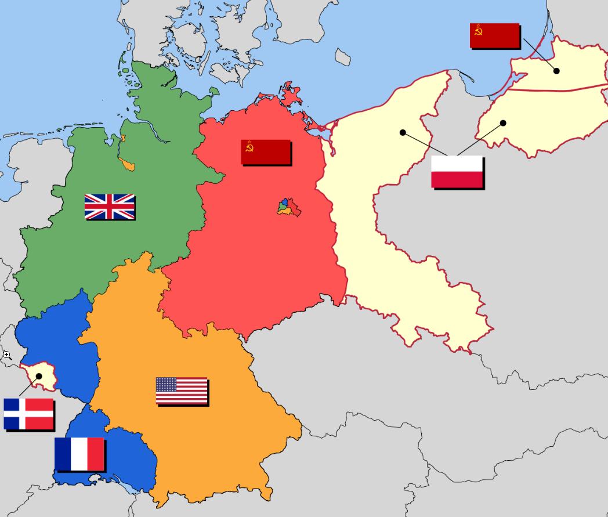
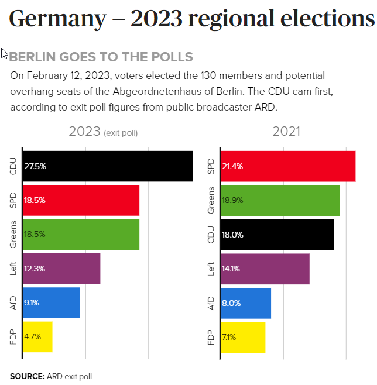

```{r setup, include=FALSE}
knitr::opts_chunk$set(echo = FALSE)

# output: powerpoint_presentation 
# output: html_document
```


# Die Besatzung  

Nachdem Deutschland im Zweiten Weltkrieg besiegt wurde, wurde es von den Alliierten besetzt. Die Bundesrepublik Deutschland wurde 1949 gegründet und nachdem änderte ihre Beziehung zu den Besatzungsmächten. Die Besatzungsmächte überwachten und setzten die Überwachung des Demokratisierungsprozesses fort.


# Konrad Adenauer

Konrad Adenauer war der erste Kanzler Deutschlands im Jahr 1949. Adenauer wird dafür anerkannt, das Land in einen demokratischen Staat zu führen, der sich mit der NATO verbunden hat. Die Adenauer-Jahre sahen die Anfänge der Bildung des *Europäischen Wirtschaftsrats*. *Der gemeinsame Markt* wurde jedoch erst nach 1967 etabliert, als ich Deutschland verließ. Adenauer hatte die Initiative zur Schaffung eines gemeinsamen Marktes ergriffen.

Ludwig Erhard war während der meisten Zeit meiner Dienstzeit Bundeskanzler von Deutschland.



# Die Endung der Besatzung

Die alliierte Besatzung Deutschlands endete offiziell mit der Unterzeichnung des Vertrags über die abschließende Regelung in Bezug auf Deutschland am 12. September 1990, als Deutschland endlich als souveräner Staat anerkannt wurde.



"History of Germany (1945--1990)." In Wikipedia, June 21, 2023. [https://en.wikipedia.org/w/index.php?title=History_of_Germany\_(1945%E2%80%931990)&oldid=1161216034](https://en.wikipedia.org/w/index.php?title=History_of_Germany_(1945%E2%80%931990)&oldid=1161216034){.uri}. 

The Saar Protectorate: officially Saarland (French: Sarre), was a French protectorate separated from Germany in 1947. 

# Amee Soldat in Deutschland

Die Berliner Mauer wurde im 1961 gebaut. Ich machte 1963 meinen Abschluss und fand 1964 meinen Platz in der US-Armee. Ich wurde in strategischer Kommunikation ausgebildet und wurde kurz nach Weihnachten 1964 nach Deutschland geschickt. Wir errichteten strategische Kommunikationseinrichtungen in ganz Europa und der Welt, um die Kommunikation von den Sowjets zu isolieren. Wir arbeiteten neben der deutschen Armee, einem NATO-Partner.


# Besatzungzeit

In der frühen Besatzungszeit von 1945 bis 1949 war es verboten, mit den Deutschen zu fraternisieren. Nach 1949 war Fraternisierung nicht nur erlaubt, sondern wurde auch gefördert. Es war eine großartige Zeit, um in Deutschland zu sein. Deutschland wurde damals als *Wirtschaftswunder* bezeichnet. Die Wirtschaft florierte, alle lebten gut und die Amerikaner wurden als Abschreckung gegenüber den Sowjets willkommen geheißen.

# Rechtsextreme politischen Partien

Es gab damals einige rechtsextreme politische Parteien, aber sie waren keine bedeutende politische Kraft. Im Juni 1966 veranstaltete die rechtsextreme Partei *NPD* Demonstrationen in Karlsruhe *gegen die Einwanderungspolitik*. Die NPD vertrat anti-immigration und Nationalismus. Ich war zu dieser Zeit Sergeant während der Proteste. Das US-Militärgeheimdienst rief alle Offiziere und Unteroffiziere zusammen, um Fotos der Demonstranten zu untersuchen. Es war verboten, dass sich ein Soldat an politischen Aktivitäten beteiligt.  

# Extremismus  

Ich war Zeuge einiger extremistischer Ansichten, aber solche Ansichten scheinen nur eine kleine Minderheit zu repräsentieren. Die Amerikaner wurden willkommen und die Beziehungen zwischen den deutschen Bürgern und den Soldaten waren freundlich und immer angenehm.

# Ruckkehr nach Deutschland  

Ich kehrte in den 1990er Jahren nach Deutschland zurück und traf dort auf einige rechtsextreme Ideologien. Ich hatte ein freundliches Gespräch mit jemandem bei einem Glas Wein, als ich gefragt wurde: "Siehst du das Haus auf dem Hügel dort?" Ja, antwortete ich. Nun, Juden leben dort. Hitler hat dieses Land einst gesäubert, schau es dir jetzt an. Wir brauchen einen weiteren Hitler." 

# AfD  *Alternative für Deutschlandz*

Deutschland ist eine führende Nation in der weltweiten Demokratie. Aber is Extremismus überall. Die AfD ist eine rechtsgerichtete politische Partei mit der größten Unterstützung aus der ehemaligen DDR.   Ich habe nichts als Respekt für die deutsche Regierung und das deutsche Volk. Sie sind ein Vorbild für die Welt.


